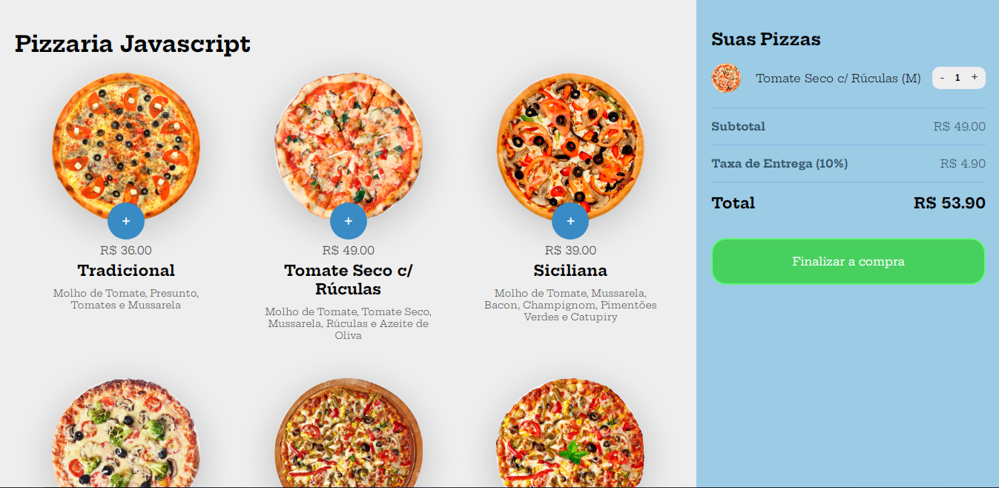

<h1 align="center">
  Pizzaria JavaScript
</h1>

## 📋 Índice

- [Preview](#-Preview)
- [Sobre](#-Sobre)
- [Tecnologias utilizadas](#-Tecnologias-utilizadas)
- [Como executar o projeto](#-Como-executar-o-projeto)

---

## 🖥 Preview

  

---

## 📖 Sobre 

Este site foi desenvolvido como projeto final de JavaScript no curso de Desenvolvedor Fullstack da B7Web com o professor Bonieky Lacerda, durante este módulo do curso foi passado os principais conceitos do JavaScript, bem como sua aplicação prática e manipulação da DOM.

---

## 🚀 Tecnologias utilizadas
O projeto está sendo desenvolvido com as seguintes tecnologias:
- CSS
- JavaScript
- HTML

---

## ⌨ Como executar o projeto

Baixe o arquivo .ZIP do projeto e após descompactar abra o arquivo index.html

---

